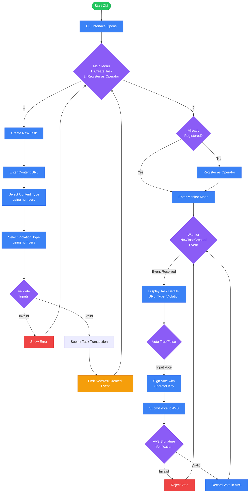

# CensorIt CLI

## Overview

[youtube](https://www.youtube.com/watch?v=JOLcf0E1xu0)  

CensorIt CLI is a command-line interface designed to streamline the reporting and verification of AVS contracts for CensorIt. This tool allows users to easily report content violations through IPFS URLs, enabling operators to verify and act on reported content efficiently.

## Features

- **Create New Task**: Report content violations by submitting the IPFS URL, content type, and violation type.
- **Register and Verify as Reporter**: Reporters can register and submit content for review.

## Installation

To install CensorIt CLI, follow these steps:

1. Clone the repository:

```bash
git clone https://github.com/CensorIt/CensorIt-CLI
```

2.Navigate to the project directory:
```bash
cd Censorit-CLI
```

3. Create a .env file from env.example and add your private key:
```bash
cp env.example .env
```

4. Install the dependencies:
```bash 
npm install
```

5. Run the CLI:
```bash 
npm run cli
```

## Usage



### Creating a New Task
When you choose to create a new task, you will be prompted for the following:

#### Content URL:
The IPFS URL of the content.
Content Type: The type of content being reported.
#### Content Type:
The Content type you are entering through the ipfs url.

#### Violation Type: 
The type of violation associated with the content.
This information will be sent as a transaction to the AVS contract on the Holesky testnet.

### Registering as an Operator
Operators can register themselves and enter monitor mode. Upon registration, they will receive events for new tasks created. The operator will then verify the content by inputting a true or false response, which is also sent as a transaction to the AVS contract.